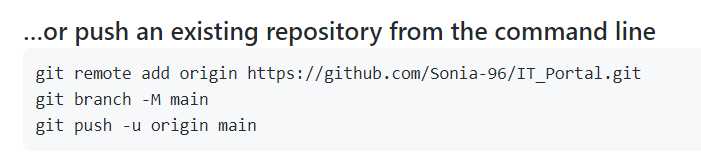

## git

- Using Git Guide: https://sp18.datastructur.es/materials/guides/using-git.html

- 图解git（待读）：https://marklodato.github.io/visual-git-guide/index-zh-cn.html#detached

  

1. 上传Github

   ```
   git add <filename>
   git commit -m "<message>"
   git push origin master 
   ```

   注：`master`是一个分支（branch）

   

2. 从GitHub中删除文件

   ```
   git rm <filename>
   // 如果文件有变动：git rm -f <filename> (-f表示强制删除)
   git commit -m "<message>"
   git push origin master
   ```

   

3. 恢复文件

   - `git log`：查看commit日志
   - `git show <commit ID>`：查看某次commit行为
   - `git checkout <commit ID> <filename>`：将文件恢复到某次commit前的状态


4. Git HEAD detached from XXX 解决办法

   HEAD相当于一个指针，指向当前所在分支。使用`git checkout <branch name>`, HEAD会移动到指定分支；但如果使用`git checkout <commit ID>`，HEAD就会处于detached状态（游离状态）。

   HEAD处于游离状态，好处是便于在历史版本之间切换，如果要回到某次提交，直接`git checkout <commit ID> <filename>`；但坏处是，此时的提交无法可见保存，一旦我们切到别的分支，游离状态的提交就不可追溯了。

   

   解决办法：新建一个临时分支保存游离状态时的提交

   ```
   git branch -v // 查看当前分支领先多少次提交
   git checkout temp //新建分支temp
   git checkout <branch name> // 切换到我们要回去的分支，比如这门课的分支是“master”
   git merge temp // 合并分支
   git status //查看合并结果，有冲突就解决
   git push origin <branch name> //提交远端，这里是master
   git branch -d temp // 删除刚才创建的临时分支
   ```


5. 撤销git add 

   git reset HEAD


5. terminal 指令
   - `dir`: 列出该文件夹下的所有文件
   - `del <fileName>`:  删除文件
   - `copy source_file target_dir`: 复制文件至


6. 撤销远端的push

   ```
   git reflog // 查看要退回的版本号（如果上一次push不要，应该退回上上次的版本）
   git reset --hard <版本号>
   git push origin master // 如果报错，则：
   git push origin master --force
   ```

   

7. 将本地的project和github连接：

   - 在git bash里输入该project的路径

   - git init

   - git add . （将文件夹里的所有文件都放入version      control）

   - git commit -m "Initial      Commit"

   - 在github上创建同名的repository，不要initiate with      readme/gigtone/license

   - 在bash里输入下面的代码，即可连接成功

     
