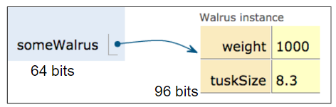

# Intro

- 课程主页：http://fa20.datastructur.es/
- lecture code: https://github.com/Berkeley-CS61B/lectureCode-fa20
- CS61B中的数据结构：https://github.com/apachecn/cs61b-textbook-zh
- Style guide: https://fa20.datastructur.es/materials/guides/style-guide.html
- CS61B 2018Spring的autograder对外开放，课程码MNXYKX：https://www.gradescope.com/
- 历年考题及解析： https://tbp.berkeley.edu/courses/cs/61B/


# Classes

## 数据类型

- **primitive types 基本类型**

  - 数值型
    - 整形：`byte`, `short`, `int`, `long`
    - 浮点型：`float`, `double`
  - 字符型：`char`
  - 布尔型：`boolean`

  | 基本类型 | 内存/bits | 默认值 |
  | -------- | --------- | ------ |
  | byte     | 8         | 0      |
  | short    | 16        | 0      |
  | int      | 32        | 0      |
  | long     | 64        | 0L     |
  | float    | 32        | 0      |
  | double   | 64        | 0      |
  | char     | 16        | /      |
  | boolean  | 1         | false  |

- **reference types 引用类型**

  基本类型以外的都是引用类型，如Arrays，自己定义的类。引用类型不管是什么类型，大小均为64位，里面储存引用对象的地址。

  
  
  

## 变量类型

- 类变量/静态变量（class variable/ static variable）：在方法外声明的变量，有`static`修饰。类变量属于整个类
- 实例变量（Instance variable）：在方法外声明的变量，不用`static`修饰
- 局部变量（local variable ）：在方法内声明的变量


>问：静态变量和实例变量的区别？

- 从语法上来说，静态变量前要有关键词`static`，而实例变量没有
- 从程序运行上来说：
  - 实例变量是属于特定对象的属性，只有当创建了实例之后，实例变量才会被分配空间，然后才能被使用
  - 静态变量是属于整个类的属性（所以也称为类变量）。只要程序加载了类的字节码，不必创建任何实例，静态变量就可以被使用
  - 总之，实例变量需在创建实例对象之后，才能通过对象调用，而静态变量可以直接通过类名调用。

## 方法类型

- Static method (又名class method 类方法）：行为不随实例变量而变，调用时前面应是**类**名称。注意，main()总是static method

- non-static method（又名Instance method 实例方法）：行为随实例变量而变，调用时前面应是**对象**名

 ```java
   // non-static method
   public void makeNoise(){
           if (weightInPounds < 10) {
               System.out.println("Yip!");
           } else if (weightInPounds < 30) {
               System.out.println("Bark!");
           } else {
               System.out.println("Wooh!");
           }
   }
   
   // static method
   public class DogLauncher() {
       public static void main(String[] args) {
           Dog d = new Dog(60);
           d.makeNoise(); 
       }
   } 
 ```

## keywords

- `public`
- `private`：private methods or variables are only accessible within the declared class.
- `protected`：只有父类和子类可以访问
- `abstract`：
  - 抽象类不能被实例化，但是能被继承
  - 定义在接口里的方法都是public且abstract的
- `final`：final修饰的类不能被继承（即**最终类**），方法不能被重写，变量值不能被修改
- super

## Golden Rules of Equals（GRoE）

`y = x`，相当于把x的所有位值复制给y。

- 如果x是引用变量，那么复制给y的是引用对象的地址。这时候，y的改变会引起x的改变，x的改变也会引起y的变化。
- 如果x是基本变量，那么复制给y的是一个值。x和y不会相互影响。

## Debug

Debugging guide： http://fa20.datastructur.es/materials/guides/debugging-guide.html

1. 设置断点（Breakpoints）

2. Conditional breakpoints：右击断点，设置断点的条件

3. 单步调试：

     - Step over & Step into：都是单步执行。区别在于，如果有函数调用，step into会进入该函数并继续单步执行；step over不进入函数，直接得出函数结果。
     - Fore step into：除了可以进入子函数，还可以进入三方库。适合用于查看源码。
     - Step out：跳出子函数

4. Drop frame：回到上一个被调用的frame。一个method算一个frame。

5. Resume Program恢复程序：一直运行程序，直到遇到断点（很适合用来对循环语句进行debug）。

# Lists 链表

## IntList

```java
public class IntList {
    public int first;
    public IntList rest;

    public IntList(int f, IntList r) {
        first = f;
        rest = r;
    }

    // 从尾到头构建链表
    public static void main(String[] args) {
        IntList L = new IntList(15, null);
        L = new IntList(10, L);
        L = new IntList(5, L);
    }
    
    // 用循环的方式连接A和B
    public static IntList dcatenate(IntList A, IntList B) {
        if (A == null) {
            return null;
        }
        IntList p = A;
        while (A != null) {
            A = A.rest;
        }
        A.rest = B;
        return p;
    }
    
    // 用递归的方式连接A和B
    public static IntList catenate(IntList A, IntList B) {
        if (A == null && B == null) {
            return null;
        }
        if (A == null) {
            return B;
        }
        return new IntList(A.first, catenate(A.rest, B));
    }
} 
```


## SLList

IntList是一种“裸露”的数据结构，用户在使用IntList时必须明白什么是reference，什么是recursion，这对新手程序员不友好。

SLList(Single Linked List) 在IntList基础上做了如下修改：

1. rebranding 重命名

   ```java
   public class IntNode {
       public int item;
       public IntNode next;
       
       public IntNode(int i, IntNode n) {
           item = i;
           next = n
       }
   }
   ```

2. 新建类SLList

3. Access control: public → private. 将SLList的实例变量设为private.

4. nested classes：将类IntNode嵌入类SLList。

   - 如果类A只被类B调用，而不被别的类调用，那么类A可以嵌套进类B里，其中类A称为**Inner class（内部类）**，类B称为**outer class/ enclosing class（外部类**）。这不会改变程序的性能，但能使程序更有组织性。

   - **Static nested class**: a static nested class cannot refer directly to instance variables or methods defined in its enclosing class -- it can use them only through an **object reference**.静态的内部类不能直接引用外部类的实例变量或方法，只能通过对象来调用。

5. **caching 缓存**: saving important data to speed up retrieval.

   - 用变量size储存结点个数，每次新增结点都使`size += 1`。

6. **sentinel node 哨兵结点**。在链表头部设置一个哨兵结点，避免出现头部结点为空的情况。


其它概念：

1. **method overloding 方法重载**。两个方法名字相同，但参数不同（类型不同或个数不同均可）。

2. invariant 不变式：数据结构中那些始终为true的条件。如，SLList的不变式有：

   - 头结点一定为哨兵结点

   	- first item 一定位于sentinel.next
    - size一定是链表的结点个数


代码：

```java
public class SLList {
    // nested static class
    public static class IntNode {
        public int item;
        public IntNode next;

        public IntNode(int x, IntNode n) {
            item = x;
            next = n;
        }
    }
    
    private IntNode sentinel; // sentinel node
    private int size; // caching

    // Create an empty list
    public SLList() {
        sentinel = new IntNode(-1, null);
        size = 0;
    }

    // Create an non-empty list
    public SLList(int x) {
        sentinel = new IntNode(-1, null);
        sentinel.next = new IntNode(x, null);
        size = 1;
    }

    public void addFirst(int x) {
        sentinel.next = new IntNode(x, sentinel.next);
        size += 1;
    }

    public void addLast(int x) {
        IntNode p = sentinel;
        while (p.next != null) {
            p = p.next;
        }
        p.next = new IntNode(x, null);
        size += 1;
    }

    public int getFirst() {
        return sentinel.next.item;
    }

    public int size() {
        return size;
    }

    public static void main(String[] args) {
        SLList L = new SLList();
        L.addLast(20);
        L.addFirst(15);
        L.addFirst(10);
        System.out.println(L.getFirst());
        System.out.println(L.size());
    }
}
```


## DLList 

在SLList基础上，DLList做了进一步的改进。

1. 增加记录尾结点的变量`last`

   在`SLList`中，每次调用`addLast()`函数，必须先从头到尾遍历链表，然后才能插入新的尾结点。用变量`last`记录尾结点，可以将这一步的时间复杂度降到O(1)。

2. 新增记录上一个结点的指针`prev`

   如果要执行操作`removeLast()`：在删除尾结点之后，还要把`last`指向链表中的倒数第二个结点。由于链表不能记录每个结点的前序结点，此时又必须从头到尾遍历链表。新设指针`prev`，记录每个结点的前序结点，可以将此步的时间复杂度降到O(1)。

3. 处理尾结点的special cases

   当链表不为空时，`last`将指向实际存在的结点；但当链表为空时，`last`将指向`sentinel`，这是一个special case。有两种方法可以处理这个问题：

   - 在链表尾部新增一个哨兵结点，`sentBack`

   - 循环链表（推荐）：`sentinel`的`prev`指向尾部结点，`next`指向头部结点

4. ==**Generics (泛型)**==

   DLList仍有一个局限性，就是只能储存int型数据。为了扩宽该数据结构的适用类型，我们可以使用**泛型**。

   使用方法：

   - 在类名称后面用尖括号标明泛型的名称：`className<genericsName>`

     ```java
     public class DDList<Bleep> {
         public class Node {
             public Node prev;
             public Bleep item;
             public Node next;
     		...
         }
         
         private Node sentinel;
         private Node last;
         private int size;
         ...
         
     }
     ```

   - 在实例化时，在类名称后标明类型，如`DDList<String>`

     ```java
     DDList<String> d2 = new DDList<>("Hello");
     ```

   - 注意：泛型只能使用引用类型，如果你要使用primitive types，名称应为：`Integer`, `Double`, `Character`, `Boolean`, `Short`, `Long`, `Byte`, `Float`.


代码：Deque的实现(即Project1A的第一部分)

```java
public class LinkedListDeque<T> {
    public class Node{
        Node prev;
        T item;
        Node next;

        public Node(Node p, T i, Node n) {
            prev = p;
            item = i;
            next = n;
        }
    }

    /** The last item is at sentinel.prev
     *  The first item is at sentinel.next
     */
    private Node sentinel;
    private int size;

    public LinkedListDeque() {
        sentinel = new Node(null, null, null);
        sentinel.next = sentinel;
        size = 0;
    }

    public void addFirst(T item) {
        sentinel.next = new Node(sentinel, item, sentinel.next);
        sentinel.next.next.prev = sentinel.next;
        size += 1;
    }

    public void addLast(T item) {
        sentinel.prev = new Node(sentinel.prev, item, sentinel);
        sentinel.prev.prev.next = sentinel.prev;
        size += 1;
    }

    // remove and return the first item
    public T removeFirst() {
        if (size == 0) {
            return sentinel.item;
        }
        size -= 1;
        Node first = sentinel.next;
        sentinel.next = first.next;
        sentinel.next.prev = sentinel;
        return first.item;
    }

    // remove and return the last item
    public T removeLast() {
        if (size == 0) {
            return sentinel.item;
        }
        size -= 1;
        Node last = sentinel.prev;
        last.prev.next = sentinel;
        sentinel.prev = last.prev;
        return last.item;
    }

    public Boolean isEmpty() {
        return size == 0;
    }

    public int size() {
        return size;
    }

    public void printDeque() {
        Node p = sentinel;
        while (p.next != sentinel) {
            System.out.print(p.next.item + " ");
            p = p.next;
        }
        System.out.println();
    }

    public T get(int index) {
        Node p = sentinel;
        for (int i = 0; i <= index; i++ ) {
            p = p.next;
        }
        return p.item;
    }

    public T getRecursive(Node p, int index) {
        if (index == 0) {
            return p.item;
        }
        return getRecursive(p.next, index - 1);
    }
    public T getRecursive(int index) {
        return getRecursive(sentinel.next, index);
    }
}
```

## AList(ArrayList)

### Array

1. Array（数组）的特点：
   - **长度固定**，N
   - 内存连续，索引速度快
   - 储存N个相同类型的元素，下标为0~N-1
   - 提取数组A的第i个元素：`A[i]`

2. 一维数组

   ```java
    // 创建Array(下面三种方式没有好坏之分)
   int[] x = new int[3];
   int[] y = new int[]{1, 2, 3, 4, 5};
   String[] z = {"hello", "you", "me"};
   
   // 提取Array长度
   int xL = x.length;
   
   // 索引、赋值和修改元素
   x[0] = y[1];
   z[1] = "hey";
   
   /** System.arraycopy(y, 3, x, 1, 2)【相当于python中的x[1:3] = y[3:5]
   /*    y - source array
   /*    3 - start position in source array
   /*    x - target array
   /*    1 - start position in target array
   /*    2 - how many items to copy
   /*  System.arraycopy比用loop要快，代码也更简洁；但可读性要差一点
   */
   System.arraycopy(y, 3, x, 1, 2);
   ```

3. 二维数组

   在下面的代码中：

   - 学习创建2D数组的三种方式
   - 区分两种复制形式的不同：
     - `z[0] = x[0]`: 复制的是数组的储存位置，所以z\[0][0]的改变会引起x\[0][0]的改变
     - `System.arraycopy(x[0], 0, w[0], 0, 3)`：将x[0]中的数字逐个复制到w[0]中。w\[0][0]的改变不会引起x\[0][0]的改变

   ```java
   public class twoDArrays {
       public static void main(String[] args) {
           int[][] x = {{1, 2, 3}, {4, 5, 6}, {7, 8, 9}};
   
           int[][] z = new int[3][];
           z[0] = x[0];
           z[1] = x[1];
           z[2] = x[2];
           z[0][0] = -z[0][0];
   
           int[][] w = new int[3][3];
           System.arraycopy(x[0], 0, w[0], 0, 3);
           System.arraycopy(x[1], 0, w[1], 0, 3);
           System.arraycopy(x[2], 0, w[2], 0, 3);
           w[0][0] = -w[0][0];
       }
   }
   ```

   Q: 运行这段代码之后，x\[0][0]和w\[0][0]各是多少？

   A: -1， 1.

5. Java Array和其它语言的区别
   - no slicing (如Python, `a[1: 5]`)
   - cannot be shunked or expanded（如Ruby）
   - no member methods（如Javascript）
   - 只能储存相同类型的元素（如Python）
   
5. Arrays vs. Classes

   - array索引用`[number]`，class索引用`.fieldName`
   - array里的元素必须是同一类型，class里的变量可以是不同类型

### Array List

在前面我们实现了Deque，它可以快速实现头部结点和尾部结点的插入和查询。但是它存在一个问题，就是`get(int i)`的时间复杂度为O(n)，这对长队列很不利。用ArrayList可以使这一步的时间复杂度变为O(1)。

要点：

1. 创立**泛型数组（generic array）**：`GType[] items = (Gtype[]) new Object[capacity]`。其中`Gtype[]`是cast，对object进行**类型转换**。（注：这行代码会有Warning，但不影响运行）

2. 当数组存满了之后，插入新数据前要先进行**动态扩容**。

   ```
   GType new_items = (GType[]) new Object[capacity * factor]; 
   ```

3. 删除数据时，最好把该位置的数据设为null，这样可以节省内存。

4. usage_ratio = size / length。当usage_ratio < 0.25 时，减小数组长度。


## Testing

1. 三种测试方式：

   - Autograder Driven Devlopment (ADD)：直接用autograder来检验代码的正确性，但这只适用于刷题，因为现实生活没有autograder
   - Unit Test（**单元测试**）：针对最小的功能单元编写测试代码。Java程序最小的功能单元是方法，所以Java的单元测试是针对单个方法进行测试。
     - 缺点：比较繁琐，那些与其它单元有联系的单元不好检测
   - Intigration Test（集成测试）：同时测试多个单元


2. JUnit

   JUnit是Java最常用的单元测试框架。使用方法：

   - 插入包：
   
        ```java
        import org.junit.Test;
        import org.junit.Assert.*;
        ```

    - 在每个测试函数前标注 `@Test`
   
    - API: https://junit.org/junit4/javadoc/4.12/org/junit/Assert.html


3. **测试驱动开发（Test-Driven Development，TDD）**

   ```ascii
   编写接口
        │
        ▼
       编写测试
        │
        ▼
   ┌─> 编写实现
   │    │
   │ N  ▼
   └── 运行测试
        │ Y
        ▼
       任务完成
   ```

   


# Inheritance

## interface接口

前面我们已经构造了AList和SLList两类，它们都有相同的方法。但因为它们不属于同一类，所以我们只能写两个函数分别调用它们（方法重载 overloading），这很麻烦。用**interface** 能解决这个问题。


我们令`List61B`是AList和SLList的superclass（父类），AList和SLList是List61B的subclass（子类）。这样在调用List61B时，既能调用AList，又能调用SLList。


语法：

```java
public interface List61B<T> {
    public void addFirst(T x);
    public void addLast(T x);
    public void insert(T x, int pos);
    public T getFirst();
    public T getLast();
    public T removeLast();
    public int size();
    public T get(int i);
}

public class SLList<Blorp> implements List61B<Blorp> {
    ...
}

public class AList<Item> implements List61B<Item>
```


注意：子类和父类之间应该是"is-a"的关系，而不是"has-a"的关系。

- cat "is an" ananimal.

- cat "has a" claw. → 这种关系不适合用来定义子类和父类。

## Implement inheritance

### Overriding 重写

如果子类与父类有方法同名且有相同的signature（返回值和形参），我们就说子类**重写**（override）了这个方法。

这时，我们在子类中该方法的上一行标注`@Override`。


overriding & overloading 的区别：

- overriding：两个方法名称相同，signature也相同
- overloading：两个方法名称相同，但是signature不同


### impelementation inheritance 实现继承

- **interface inheritance**：

  - subclass inherits signatures, but not implementation
  - 只定义方法名和signature，不定义方法的具体内容（即不告诉子类该如何做）

- **implementation inheritance**: 

  - subclass can inherit both signatures and implementation

  - 要定义方法的具体内容

  - 语法：在父类中定义该方法，且前面要加上关键词**`default`**。例：

    ```java
    default public void print() {
        for (int i = 0; i < size(); i += 1) {
            System.out.print(get(i) + " ");
        }
        System.out.println();
    }
    ```

### Dynamic method selection

1. **Dynamic method selection**

   一个程序分为编译和运行两个部分：

   - 编译时：
     - 检查变量赋值是否有效（valid）
     - 检查方法调用是否有效（只检查static type）
   - 运行时：
     - 检查重写的方法（检查dynamic type）
     - 确保被转型的对象可以被分配给相应的变量

   

   问：在`List61B`和`AList`中各定义一个signature相同的`print()`方法，问：在下面的代码中，调用的是`List61B`还是`AList`里的`print()`?

    ```java
    List61B<String> lst = new SLList<>();
    lst.print();
    ```

   

   一个变量可以有两种类型：

   - **compile-time type (static type)** **编译时的类型**：变量声明时定义的type
   - **run-time type (dynamic type)** **运行时的类型**：变量实例化时定义的type

   例如，在上面的代码中，`lst`的static type是`List61B`，而dynamic type是`SLList`。

   如果Java要运行一个被重写的方法，它会优先选择dynamic type的方法，这个原则叫”dynamic method selection“。所以，在上面的代码中，`lst.print()`运行的是`SLList`中的方法。

   

   注意：这个原则**不**适用于重载的方法。对于重载的方法，java只匹配变量的static type。

## Extends inheritance

### extends

`extends`可以继承父类的如下东西：

- 所有的实例变量和静态变量
- 所有非私有的方法
- 所有非私有的嵌套类（nestest class）

注意：`extends`不能继承父类的构造器。

### super

- 如果子类中重写了某方法A，在该类中调用父类的方法A时，要在前标注`super.`，否则会默认调用子类的方法A。

- 子类在调用父类的构造器时，必须使用函数`super()`，并标名参数类型。例如，`SLList`有两个构造器，`SLList()`用来构造空链表，而`SLList(T x)`则用来构造有一个结点的链表。`super()`表示调用前者，`super(T x)`表示调用后者。如果子类的构造器中没有调用super函数，则Java默认调用没有参数的那个构造器。

  ```java
  public class VengefulSLList<T> extends SLList<T> {
      SLList<T> deletedItems;
      
      public VengefulSLList() {
          deletedItems = new SLList<>(); //若不指明，则默认调用super()
      }
      
      // 这个构造器和上面的构造器效果一样
      public VengefulSLList() {
          super(); // 调用无参数的构造器
          deletedItems = new SLList<>(); 
      }
      
      public VengefulSLList(T x) {
          super(x); // 调用有参数的构造器
          deletedItems = new SLList<>();
      }
  }
  ```

  

### Object

`Object`类是所有类的父类，其它类都是它的子类。


`Object`类中的方法，如`.equals(Object obj)`, `.hashCode()`,  `.toString()`等，都可以被子类继承。


Object类包含以下方法：

- **`String toString()`**
- **`boolean equals(Object obj)`**
- `Class <?> getClass()`：获取对象的dynamic type
- `int hashCode()`
- `protected Object clone()`：浅拷贝
- `protected void finalize()`
- `void notify()`
- `void notifyAll()`
- `void wait()`
- `void wait(long timeout)`
- `void wait(long timeout, int nanos)`

今天我们要重写`toString()`和`equals()`。


1. `toString()`

   每当我们运行`System.Out.println(Object x)`时，Java就会默认调用`toString()`函数，把要打印的内容转型为字符串。但是，`ArraySet.toString()`只能打印出对象所在的储存位置，不能打印出其具体内容。

   

   例如：

   ```java
   ArraySet<String> aset = new ArraySet<>();
   aset.add("horse");
   aset.add("fish");
   aset.add("house");
   aset.add("fish");
   
   System.out.println(aset);
   ```

   若不重写`toString()`，输出为：

   ```
   ArraySet@4e50df2e
   ```

   

   重写方法：

   ```java
       @Override
       public String toString() {
           StringBuilder SB = new StringBuilder("{");
           for (int i = 0; i < size - 1; i++) {
               SB.append(items[i] + ", ");
           }
           SB.append(items[size - 1] + "}");
           return SB.toString();
       }
   ```

   *注意：在Java中 String是不能变的（immutable），哪怕只是加上一个 char，也要新建整个字符串，非常费时。所以这里用了`StringBuilder`，它是可以变的。*

   

   此时，输出变为

   ```
   {horse, fish, house}
   ```

   

   更好的实现方法：

   ```java
       @Override
       public String toString() {
           List<String> listOfItems = new ArrayList<>();
           for (T x: this) {
               listOfItems.add(x.toString());
           }
           return "{" + String.join(", ", listOfItems + "}";
       }
   ```

   

   

2. `equals()`

   `equals(Object)`的源代码如下：

   ```java
   public boolean equals(Object obj) {
       return (this == obj);
   }
   ```

   可见，`Object a.equals(Object b)`，只有在a和b指向同一个对象（即memory location相同）时才会返回`true`。

   重写该函数：

   ```java
       @Override
       public boolean equals(Object other) {
           if (this == other) {
               return true;
           }
           if (other == null) {
               return false;
           }
           if (this.getClass() != other.getClass()) {
               return false;
           }
           ArraySet<T> o = (ArraySet<T>) other;
           if (this.size() != o.size()) {
               return false;
           }
           for (T item : o) {
               if (!this.contains(item)) {
                   return false;
               }
           }
           return true;
       }
   ```

   注：`.getClass()`可获得对象的dynamic type。

   

3. `Arrayset.of()`

   - 由于`of`是static，它无法获取type T，所以必须另外命名一个泛型。==？？？==
   - 的

   ```java
       @SafeVarargs //抑制编译器警告
       public static <E> ArraySet<E> of(E... stuff) {
           ArraySet<E> aset = new ArraySet<>();
           for (E item: stuff) {
               aset.add(item);
           }
           return aset;
       }
   ```

   


### Encapsulation

- 定义：隐藏对象的属性和实现细节，仅对外公开接口。
- 目的：
  - 增强安全性。隐藏代码和数据
  - 简化编程。使用者无需了解代码细节，即可通过接口访问类


### type checking & Casting

1. 转型或者调用非重写的方法时，java编译器会检查对象的static type

   - 转型时只能“**向上转型**”，即子类可以转型为父类，但父类不可转型为子类

     ```java
        List61B<String> L = new SLList<>(); // 不报错。static type为List61B，dynamic type为SLList
        SLList<String> L = new List61B<>(); // compile-error
     ```
   - 父类不能调用子类中非重写的方法

2. Casting 转型：改变static type
	如果无法实现转型（比如把`Double`转为`Integer`），则会报runtime error。
	
	```java
	  List61B<String> L = new SLList<>();
	  SLList S = (SLList) L; // 转型
	```

### Higher Order Function

定义：把其它函数作为参数的函数。

例如，下面的python程序中，do_twice就是higher order function。

```python
def tenX(x):
    return 10 * x

def do_twice(f, x):
    return f(f(x))

print(do_twice(tenX, 2)) // 输出值200
```

用java来写同样的程序：

```java
public interface IntUnaryFunction {
    int apply(int x);
}

public class TenX implements IntUnaryFunction{
    public int apply(int x) {
        return 10 * x;
    }
}

public class HoFDemo {
    public static int do_twice(IntUnaryFunction f, int x) {
        return f.apply(f.apply(x));
    }

    public static void main(String[] args) {
        IntUnaryFunction f = new TenX();
        System.out.println(do_twice(f, 2));
    }
}
```


总结：

- 子类可以从父类中继承**非私有**的变量、方法、嵌套子类
- 在子类中可以用`super`来调用父类的成员
  - 子类的构造器中，第一行必须用`super(args)`来调用父类的构造器
  - 调用方法时，用`super.methodName(args)`
- 编译器只检查对象的static type
- 调用重写的方法时，根据的是对象的dynamic type
- 可以用`(typeName)`对对象进行强制类型转换


## Subtype Polymorphism

1. Polymorphism 多态
   - 定义：provide a single interface to entities of different types


2. Comparable

   `Comparable<T>`是Java内置的一个接口。

   - 很多Java内置的类都实施了`Comparable`，如`String`

   - 很多库也用到了`Comparable`接口，如`Arrays.sort`

   ```java
   public class Dog implements Comparable<Dog>{
       private String name;
       private int size;
   
       @Override
       public int compareTo(Dog o) {
           return this.size - o.size;
       }
   ```

   

3. Comparator

   `Comparator`也是Java的一个内置类，但是调用它前需要先import（**Comparable不需要**）

   ```java
   import java.util.Comparator;
   
   public class Dog implements Comparable<Dog> {
       ...
       private static class NameComparator implements Comparator<Dog> {
           public int compare(Dog a, Dog b) {
               // a.compareTo(String b)可比较字符串a和b大小
               // 返回值<0，则a<b; =0则a==b; >0则a>b
               return a.name.compareTo(b.name); 
           }
       }
   
       public static Comparator<Dog> getNameComparator() {
           return new NameComparator();
       }
   }
   ```

   


## implements vs. extends

| implements                                                   | extends                                                      |
| ------------------------------------------------------------ | ------------------------------------------------------------ |
| 使用`implements`，可使一个类继承一个接口                     | 使用`extends`，可使一个类继承另一个类，或使一个接口继承另一个接口 |
| 接口中通常只规定方法的名称和signature，没有具体的实施方法；如果规定了具体的实施方法，需在返回型前加关键词`default`。**接口不能实例化**。 | 类中有方法的具体实施方式                                     |
| 子类必须implements接口中的所有方法                           | 子类不必override父类中的所有方法                             |
| 一个类可以同时implements多个接口，如`class A implements B, C` | 一个类只能extends一个类                                      |
| 一个接口不能用`implements`继承另一个接口                     | 一个接口可以用`extends`继承另一个接口                        |


# Iteration

## List, Set

List 和 Set 都是Java的内置接口。

1. List

   `List`有多种实施方式，`ArrayList()` 是其中一种，它无大小限制。

   - `add(int index, T item) `: 在index位置插入元素item；如果无index，则默认插到数组末尾。

   ```java
   import java.util.List;
   import java.util.ArrayList;
   
   public class Example {
       public static void main(String[] args) {
           List<Integer> L = new ArrayList<>();
           L.add(5);
           L.add(10);
           L.add(15);
           System.out.println(L); // 输出结果：[5, 10, 15]
       }
   }
   ```

 

2. Set

   - set: a collection of unique elements with no order
   - `Set`有多种实施方式，`HashSet()`是其中一种

   ```java
   import java.util.Set;
   import java.util.HashSet;
   
   public class Example {
       public static void main(String[] args) {
           Set<String> S = new HashSet<>();
           S.add("Tokyo");
           S.add("New York");
           S.add("Beijing");
           S.add("Tokyo");
           System.out.println(S); // [Beijing, New York, Tokyo]
           System.out.println(S.contains("New York")); // true
       }
   }
   ```


## Exception

1. throw exception

    - 报错时程序就停止运行

    - 语法：`throw new ExceptionObject(parameter1, ...)`。例：

      ```java
        public void add(T x) {
              if (x == null) {
                  throw new IllegalArgumentException("can't add null");
              }
              ...
          }
      ```


2. Catch Exception

   - 报错时程序仍继续运行

   - 语法：

     ```java
     try {
         // something that may throw an exception
     } catch (Exception e) {
         // Do something about it 
     }
     ```

     

## Iteration

1. `Iterator` & `Iterable`接口

   - `Iterator`: objects that can be iterated through in Java
     - 得到的迭代器不能使用for-each循环
     - `Iterator`中要求的方法：
       - `boolean hasNext()`
       - `T next()`
    - `Iterable`: objectes that can produce an iterator
         - `implements Iterable<> `得到的迭代器可以使用for-each循环
         - `Iterable`中要求的方法：
           - `iterator()`

       ```java
       public class ArraySet<T> implements Iterable<T> {
           ...
       
           @Override
        	public Iterator<T> iterator() {
               return new ArraySetIterator();
           }
       
           private class ArraySetIterator implements Iterator<T> {
               private int pos;
       
               public ArraySetIterator() {
                   pos = 0;
               }
       
               @Override
               public boolean hasNext() {
                   return pos < size;
               }
       
               @Override
               public T next() {
                   pos += 1;
                   return items[pos - 1];
               }
           }
       }
       ```


2. `Set`的工作原理
   - 层级：`Iterable<T>` <-- `Collection<T>` <-- `Set<T>`
   - 源码：（注释远比代码要多！）
     - [Iterable](https://github.com/AdoptOpenJDK/openjdk-jdk11/blob/999dbd4192d0f819cb5224f26e9e7fa75ca6f289/src/java.base/share/classes/java/lang/Iterable.java)
     - [Collection](https://github.com/AdoptOpenJDK/openjdk-jdk11/blob/999dbd4192d0f819cb5224f26e9e7fa75ca6f289/src/java.base/share/classes/java/util/Collection.java)
     - [Set](https://github.com/AdoptOpenJDK/openjdk-jdk11/blob/999dbd4192d0f819cb5224f26e9e7fa75ca6f289/src/java.base/share/classes/java/util/Set.java)

