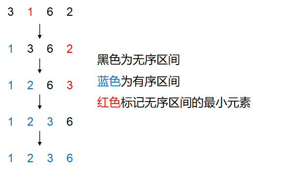
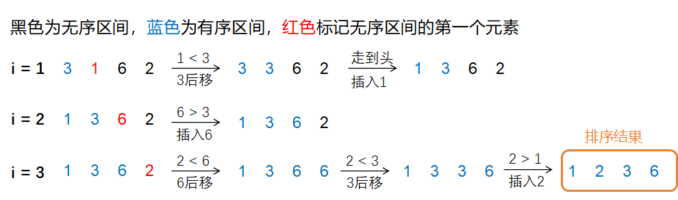
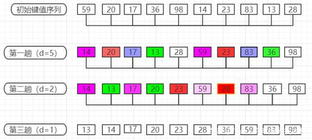

[TOC]


# 排序算法

## 选择排序

将数组分为无序区间和有序区间，一开始无序区间的范围为[0:n)，有序区间为[0:0)（为空）。遍历无序区间，找出最小的元素放到无序区间的头部，然后有序区间右界+1，无序区间左界-1。重复此操作，直至无序区间为空。



```java
public int[] selectionSort(int[] nums) {
    for (int i = 0; i < nums.length - 1; i++) {
        int minIndex = i;
        for (int j = i + 1; j < nums.length; j++) {
            if (nums[j] < nums[minIndex]) {
                minIndex = j;
            }
        }
        int minNum = nums[minIndex];
        nums[minIndex] = nums[i];
        nums[i] = minNum;
    }
    return nums;
}
```

- 时间复杂度：
  - 最好：Θ(n<sup>2</sup>)
  - 最坏：Θ(n<sup>2</sup>)
  - 平均：Θ(n<sup>2</sup>)
- 空间复杂度：Θ(1)【原位排序】
- 不稳定排序，例：{5, 8, 5, 2, 9}

## 冒泡排序

将数组分为无序区间和有序区间，初始无序区间为[0:n)，有序区间为[n: n)。

在无序区间中，从左到右依次比较相邻的两个元素，如果左侧元素>右侧元素，则两者交换位置。这样的比较每进行一轮，就能将无序区间中最大的元素放到其末尾。然后无序区间右界-1，有序区间左界-1。这个过程就如同冒泡一样，所以称为“冒泡算法”。

写法一：对于数组，如果它没有进行swap操作，则说明数组有序

```java
public int[] bubbleSort1(int[] nums) {
    for (int i = 0; i < nums.length - 1; i++) {
        boolean swap = false; // 提前退出循环的标志
        for (int j = 0; j < nums.length - i - 1; j++) {
            if (nums[j] > nums[j + 1]) {
                swap(nums, j, j + 1);
                swap = true;
            }
        }
        // 如果swap为false，则数组排序已完成
        if (!swap) {
            break;
        }
    }
    return nums;
}

private void swap(int[] nums, int i, int j) {
    int tmp = nums[i];
    nums[i] = nums[j];
    nums[j] = tmp;
}
```

写法二：没有进行swap操作的那部分数组是有序的

```java
public int[] bubbleSort2(int[] nums) {
    int i = nums.length - 1;
    while (i > 0) {
        int lastSwap = 0;
        for (int j = 0; j < i; j++) {
            if (nums[j] > nums[j + 1]) {
                swap(nums, j, j + 1);
                lastSwap = j;
            }
        }
        // 经过一轮比较后，nums[:lastSwap)为无序区间，nums[lastSwap:]为有序区间
        // 下一轮只需在无序区间内继续比较
        i = lastSwap;
    }
    return nums;
}
```

- 时间复杂度：
  - 最好：对正序数组，Θ(n)
  - 最坏：对倒序数组，Θ(n<sup>2</sup>)
  - 平均：Θ(n<sup>2</sup>)
- 原位排序
- 稳定排序：两个元素相等时不交换位置

## 插入排序

将数组分为有序区间和无序区间，初始有序区间为[0:1)，无序区间为[1:n)。每次取无序区间的第一个元素放入有序区间的正确位置，具体比较方式见下图。（感觉插入排序就是反方向的冒泡排序）

```java
public int[] insertionSort(int[] nums) {
    for (int i = 1; i < nums.length; i++) {
        int j = i - 1, tmp = nums[i];
        while (j >= 0 && tmp < nums[j]) {
            nums[j + 1] = nums[j];
            j -= 1;
        }
        nums[j + 1] = tmp;
    }
    return nums;
}
```

- 时间复杂度：
  - 最好：对正序数组，Θ(n)
  - 最坏：对倒序数组，Θ(n<sup>2</sup>)
  - 平均：Θ(n<sup>2</sup>)
- 原位排序
- 稳定排序：两个元素相等时不交换位置

## 希尔排序

希尔排序是插入排序的改进版，也称**缩小增量排序**。

插入排序慢的原因在于元素一次只能移动一位。对于那些在数组末尾的小元素，如{5, 4, 3, 2, 1}中的1，要移动n-1位才能到正确位置。希尔排序在此基础上进行了改进，采用**跳跃式分组**的策略，使得元素一次可以挪动多位。

具体实施：（这里采用增量缩小的方式为缩小为原来的一半）

- 对数组按一定增量（这里设置为数组长度的二分之一）进行分组，对每组使用插入排序算法进行排序
- 将增量缩小一半，重复上面的操作
- 不断缩小增量，当增量缩小至0时，排序完成



当增量为1时，希尔排序退化为插入排序。

```java
public int[] shellSort(int[] nums) {
    int gap = nums.length >> 1;
    while (gap > 0) {
        for (int i = gap; i < nums.length; i++) {
            int tmp = nums[i];
            int j = i - gap;
            while (j >= 0 && tmp < nums[j]) {
                nums[j + gap] = nums[j];
                j -= gap;
            }
            nums[j + gap] = tmp;
        }
        gap >>= 1;
    }
    return nums;
}
```

- 时间复杂度：希尔排序的时间复杂度与增量的缩小方式有关，这里取每次缩小一半来计算其时间复杂度
  - 最好：对正序数组，Θ(nlogn)
  - 最坏：对倒序数组，Θ(nlogn)
  - 平均：Θ(nlogn)
- 原位排序
- 不稳定排序：虽然插入排序是稳定排序，但希尔排序是不稳定排序，因为它采用的是跳跃式插入。例，数组{2, 2, 1, 5}。

## 归并排序

先将数组分成两个部分，两边各自排序，然后将排序后的数组合并。

```java
private void merge(int[] nums, int left, int mid, int right) {
    int n1 = mid - left + 1, n2 = right - mid;
    int[] L = new int[n1], R = new int[n2];
    System.arraycopy(nums, left, L, 0, n1);
    System.arraycopy(nums, mid + 1, R, 0, n2);
    int p1 = 0, p2 = 0;
    while (p1 < n1 && p2 < n2) {
        if (L[p1] <= R[p2]) {
            nums[left++] = L[p1++];
        } else {
            nums[left++] = R[p2++];
        }
    }
    for (; p1 < n1; p1++) {
        nums[left++] = L[p1];
    }
    for (; p2 < n2; p2++) {
        nums[left++] = R[p2];
    }
}

private void sort(int[] nums, int left, int right) {
    if (left >= right) {
        return;
    }
    int mid = left + ((right - left) >> 1);
    sort(nums, left, mid);
    sort(nums, mid + 1, right);
    merge(nums, left, mid, right);
}

public int[] mergeSort(int[] nums) {
    sort(nums, 0, nums.length - 1);
    return nums;
}
```

- 时间复杂度：
  - 最好：Θ(nlogn)
  - 最坏：Θ(nlogn)
  - 平均：Θ(nlogn)
- 空间复杂度：Θ(n)
- 稳定排序

## 快速排序

策略：

- 选取待排数组中任意一个数字作为分区点pivot（主元）
- 遍历数组中的元素，把小于pivot的元素放到pivot左边，大于pivot的元素放到pivot右边
- 对pivot两侧的区域重复步骤1和步骤2，直至分区长度为1

```java
// 随机选一个元素为主元
private int partition(int[] nums, int start, int end) {
    int idx =  start +(int) (Math.random() * (end - start + 1)); // 产生一个范围在[start, end]的随机整数
    int pivot = nums[idx];
    int j = start; // j是小于等于主元的元素区间的右界（不包含）
    swap(nums, j, idx); // 把主元放到数组开头
    for (int i = start + 1; i <= end; i++) {
        if (nums[i] <= pivot) {
            j++;
            swap(nums, j, i);
        }
    }
    swap(nums, j, start);
    return j;
}

public void quickSort(int[] nums, int start, int end) {
    if (start >= end) {
        return;
    }
    int p = partition(nums, start, end);
    quickSort(nums, start, p - 1);
    quickSort(nums, p + 1, end);
}

public int[] quickSort(int[] nums) {
    quickSort(nums, 0, nums.length - 1);
    return nums;
}
```

- 时间复杂度：
  - 最好：分区平衡，每次都选择中间大小的元素作为pivot，Θ(nlogn)
  - 最坏：分区极不平衡，如每次都选到最小的元素作为pivot，Θ(n<sup>2</sup>)
  - 平均：Θ(nlogn)
- 原位排序，空间复杂度O(logn)（递归栈调用）
- 不稳定排序：经`partition()`函数处理后，pivot将放在所有相等元素的最后

## 三区快速排序

快速排序的最坏情况：

- 每次都选到最小的元素。解决办法：随机选取主元
- 数组元素全部一样。解决办法：**三区快速排序**！

暂略。

## 计数排序

策略：

- 假设数列为A[1...n]，里面数字变化的范围为0~m
- 记录数字0~m的出现频次
- 新建一个数组，把数字按记录的频次从小到大依次填进去

```java
public int[] countingSort(int[] nums) {
    // 找到最大数字
    int maxNum = 0;
    for (int i = 0; i < nums.length; i++) {
        maxNum = Math.max(maxNum, nums[i]);
    }
    // 记录每个数字出现的频次
    int[] counts = new int[maxNum + 1];
    for (int i = 0; i < nums.length; i++) {
        counts[nums[i]]++;
    }
    // 计算每种数字在结果数组中的右界（不包含）
    for (int i = 1; i < maxNum + 1; i++) {
        counts[i] = counts[i] + counts[i - 1];
    }
    // 将数字填入结果数组
    int[] res = new int[nums.length];
    for (int i = nums.length - 1; i >= 0; i--) {
        int pos = counts[nums[i]] - 1;
        res[pos] = nums[i];
        counts[nums[i]]--;
    }
    return res;
}
```

- 时间复杂度：
  - 最好：Θ(n+m)
  - 最坏：Θ(n+m)
  - 平均：Θ(n+m)
- 空间复杂度：Θ(n+m)，m为数字的最大值
- 稳定排序

计数排序的适用情景：

- m和n的值接近或m<<n，m越小，效果越好。例如，高考分数0-750，考生人数100万，可用计数排序对考生排名
- 数字均为非负整数。如果有负数，则要在不改变数字相对大小的前提下将数字改为非负整数。

## 堆排序

### 原位堆排序

1. Build a heap: sink each element from the first non-leaf node to the root.
2. removeBiggest() for (n - 1) times

```java
public class InPlaceHeapSort {
    int[] heap;
    int size;

    public InPlaceHeapSort(int[] nums) {
        heap = nums;
        size = nums.length;
    }

    public void heapSort() {
        int n = heap.length;
        // Build a max heap
        for (int i = n / 2 - 1; i >= 0; i--) {
            sink(i);
        }
        // Sort the array
        for (int i = 1; i < n; i++) {
            removeBiggest();
        }
    }

    private void removeBiggest() {
        swap(0, --size);
        sink(0);
    }

    private void sink(int k) {
        int left = k * 2 + 1, right = k * 2 + 2, maxIndex = k;
        if (left < size && heap[left] > heap[k]) {
            maxIndex = left;
        }
        if (right < size && heap[right] > heap[maxIndex]) {
            maxIndex = right;
        }
        if (k != maxIndex) {
            swap(k, maxIndex);
            sink(maxIndex);
        }
    }

    private void swap(int i, int j) {
        int temp = heap[i];
        heap[i] = heap[j];
        heap[j] = temp;
    }
}
```

Complexity analysis:

- Time complexity: Θ(nlogn)

  - Build the heap: amortized time complexity is Θ(n)

  - Sort the heap: Θ(nlogn)

- Space complexity: Θ(logn), used for space stack in recursive calls
- 不稳定排序

# 总结

| 排序算法     | 最好时间复杂度   | 最坏时间复杂度   | 平均时间复杂度   | 空间复杂度    | 稳定性 |
| ------------ | ---------------- | ---------------- | ---------------- | ------------- | ------ |
| 选择排序     | O(n<sup>2</sup>) | O(n<sup>2</sup>) | O(n<sup>2</sup>) | O(1)，原位    | 稳定   |
| 冒泡排序     | O(n)             | O(n<sup>2</sup>) | O(n<sup>2</sup>) | O(1)，原位    | 稳定   |
| 插入排序     | O(n)             | O(n<sup>2</sup>) | O(n<sup>2</sup>) | O(1)，原位    | 稳定   |
| 希尔排序     | O(nlogn)         | O(nlogn)         | O(nlogn)         | O(1)，原位    | 不稳定 |
| 归并排序     | O(nlogn)         | O(nlogn)         | O(nlogn)         | O(n)          | 稳定   |
| 快速排序     | O(nlogn)         | O(n<sup>2</sup>) | O(nlogn)         | O(logn)，原位 | 不稳定 |
| 三区快速排序 |                  |                  |                  |               |        |
| 计数排序     | O(n+\|Σ\|)       | O(n+\|Σ\|)       | O(n+\|Σ\|)       | O(n+\|Σ\|)    | 稳定   |
| 堆排序       | O(nlogn)         | O(nlogn)         | O(nlogn)         | O(logn)       | 不稳定 |

